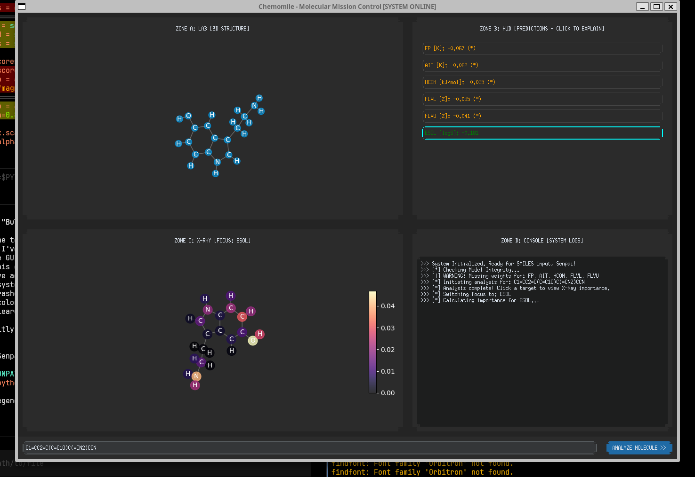

# Chemomile


"Chemomile: Explainable Multi-Level GNN Model for Combustion Property Prediction", **Beomgyu Kang** and Bong June Sung*, *J. Phys. Chem. A* 2025, 129, 1880-1889, https://doi.org/10.1021/acs.jpca.5c00380

## Modernized Architecture (2026 Upgrades)
Chemomile has been recently upgraded with several state-of-the-art features:
- **Fast Training:** Integrated **Automatic Mixed Precision (AMP)** and **Vectorized Batching** for significant GPU and CPU acceleration.
- **Advanced HPO:** Added **Optuna** for Bayesian Hyperparameter Optimization with intelligent pruning.
- **Improved Explainability:** Implemented **Integrated Gradients** for smoother and mathematically grounded atom-level attribution.
- **Optimized Data Pipeline:** Parallel SMILES-to-Graph featurization with **HDF5-compressed caching**.
- **Molecular Mission Control:** A high-performance, dark-mode GUI for real-time molecular analysis and explainability.
- **Training Stability:** Added **Early Stopping** and **Gradient Clipping** to ensure robust convergence.

## Molecular Mission Control (GUI)



Chemomile now features a professional-grade dashboard for interactive molecular analysis:
- **Interactive HUD:** Click on any predicted property to instantly pivot the explainability focus.
- **3D Lab Zone:** Synchronized 3D visualization of molecular structures.
- **X-Ray Analysis:** Real-time heatmaps showing atomic contributions to specific combustion properties.
- **System Integrity:** Automatic weight-loading verification and notification system.

To launch the dashboard:
```bash
python gui.py
```

## Installation

### Using Conda (Recommended)
```bash
conda env create -f environment.yml
conda activate chemomile
```

### Using Pip
```bash
pip install -r requirements.txt
```

## Notes
Due to copyright issue, datasets are not included in this git.
The dataset is a csv file with format:

| | SMILES | Value |
|-|------:|-------|
|0|CC|12.4|
|...|...|...|

The path for datafiles can be defined when calling `Dataset()`. Pre-processed data is cached in `data/DATADUMP/` using HDF5 for efficiency.

## How to use

Target properties can be selected in each `.py` file.

- **Single Training Cycle**
```python
python single_run.py
```

- **Bayesian Hyperparameter Optimization (Optuna)**
```python
python scripts/optunaOpt.py
```

- **Particle Swarm Optimization (PSO)**
```python
python scripts/particleSwarmOpt.py
```

- **Ensemble Training Cycle**
	- k-fold ensemble training/testing cycles (parallel)
	- returns average prediction for each fold
```python
python ensemble_run.py
```

- **Explainability (XAI)**
	- Uses **Integrated Gradients** and **Atom Masking** to visualize atomic contributions in 3D.
	- See `src/explainer.py` and the [example tutorial](./examples/Chemomile_Tutorial.ipynb).

## Comment
If you're not sure how to use this model, please consult the [example tutorial](./examples/Chemomile_Tutorial.ipynb)

## Citation

```
@article{kang2025chemomile,
    author = {Kang, Beomgyu and Sung, Bong June},
    title = {Chemomile: Explainable Multi-Level GNN Model for Combustion Property Prediction},
    journal = {The Journal of Physical Chemistry A},
    volume = {129},
    number = {7},
    pages = {1880-1889},
    year = {2025},
    doi = {10.1021/acs.jpca.5c00380},
    note ={PMID: 39927844},
    URL = {https://doi.org/10.1021/acs.jpca.5c00380},
    eprint = {https://doi.org/10.1021/acs.jpca.5c00380}
}
```
